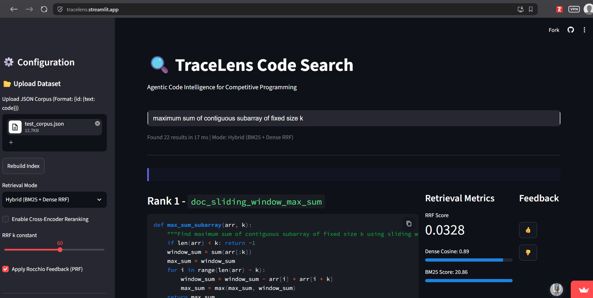
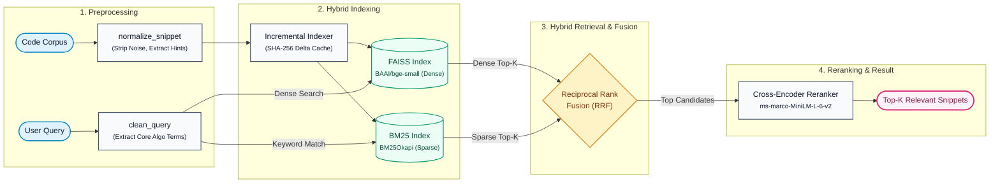

# TraceLens - Agentic Code Intelligence

[](https://www.python.org/downloads/)
[](https://huggingface.co/datasets/CoIR-Retrieval/apps)

> **Samsung PRISM Generative AI Hackathon Submission**  
> **Theme 01:** Agentic Code Intelligence  
> **Team Name:** RepoKids  
> **Institution:** SRM Institute of Science and Technology (SRMIST)

---

## 📌 Submission Artifacts & Deliverables

<details open>
<summary><b>🎬 Live Demo Video</b></summary>
<br>

- **File:** [`Demo_video.mp4`](https://github.com/shreya-roy1/TraceLens/blob/main/Demo_video.mp4) (attached in root and GitHub Release)
- **Duration:** ~90 seconds demonstrating live query search, sub-25ms latency, hybrid dense/sparse metrics, and cross-encoder reranking.
</details>

<details open>
<summary><b>🖼️ Demo Screenshots & Architecture Diagram</b></summary>
<br>

- **Streamlit Demo Screenshot:** [`docs/demo_screenshot.png`](https://github.com/shreya-roy1/TraceLens/blob/main/docs/demo_screenshot.png)  
  
- **Architecture Pipeline:**


</details>

<details open>
<summary><b>📊 Presentation Pitch Deck (PPTX)</b></summary>
<br>

- **Presentation Slide Deck:** [`SRMIST_RepoKids_Submission.pptx`](https://github.com/shreya-roy1/TraceLens/blob/main/SRMIST_RepoKids_Submission.pptx)
- **Outline & Notes:** [`docs/deck_outline.md`](https://github.com/shreya-roy1/TraceLens/blob/main/docs/deck_outline.md)
</details>

<details open>
<summary><b>📝 AI Usage Disclosure Form</b></summary>
<br>

- **Signed PDF Disclosure:** [`LangAI3.0_AI_Disclosure_RepoKids.pdf`](https://github.com/shreya-roy1/TraceLens/blob/main/LangAI3.0_AI_Disclosure_RepoKids.pdf)
</details>

<details open>
<summary><b>📂 Comprehensive Test Corpus (JSON)</b></summary>
<br>

- **Benchmarking / Verification File:** [`docs/test_corpus.json`](https://github.com/shreya-roy1/TraceLens/blob/main/docs/test_corpus.json)
- Includes 22 competitive programming algorithms (DP, Bellman-Ford, Dijkstra, Trie, Segment Tree, Sliding Window, Backtracking).
</details>

---

## 🎯 Problem Overview & Submission Goals

In large software systems and competitive programming corpora, finding the precise algorithm or code block from a natural-language query is a core bottleneck.

### Why Pure LLM Ranking Fails

- The number of snippets across repositories ranges in the thousands, quickly exceeding LLM context windows.
- Retrieval must be sub-second to act as an efficient first-stage filter before any generation step.

### Submission Goals Alignment

- **P0: Retrieval Accuracy (Screening Metric):** Multi-stage hybrid search combining dense semantic embeddings (`BAAI/bge-small-en-v1.5`) and lexical sparse search (`BM25Okapi`), fused via **Reciprocal Rank Fusion (RRF)** and reranked using an MS-MARCO Cross-Encoder.
- **P1: Retrieval Across Versions:** Real-world codebases evolve continuously. TraceLens implements an **Incremental Indexer** with **SHA-256 digest caching**, re-indexing only modified functions in sub-milliseconds without expensive full re-computations.
- **CPU Resource Efficiency:** Designed to run purely on lightweight CPU environments without requiring dedicated GPU nodes.

---

## 🏗️ Architecture Pipeline

1. **Preprocessing (`clean.py`):** Strips competitive programming I/O boilerplate and extracts domain hints (`graph`, `dp`, `bitmask`, `heapq`, `bisect`).
2. **Dual-Index Search (`pipeline.py`):**
   - **Dense Index:** `BAAI/bge-small-en-v1.5` embeddings loaded into FAISS `IndexFlatIP`.
   - **Sparse Index:** `BM25Okapi` over normalized tokens.
3. **Reciprocal Rank Fusion (RRF):** Fuses scores using $Score(d) = \sum \frac{1}{60 + \text{rank}}$.
4. **Cross-Encoder Reranking:** Re-scores top fused candidates with `cross-encoder/ms-marco-MiniLM-L-6-v2`.
5. **Incremental Indexing (`incremental.py`):** Uses `.tracelens_cache.json` SHA-256 digests to bypass unchanged code chunks.

---

## 🚀 Setup & Local Execution Guide

### 1. Environment Setup

```bash
# Clone the repository
git clone https://github.com/shreya-roy1/TraceLens.git
cd TraceLens

# Create and activate virtual environment
python -m venv venv
# On Windows:
.\venv\Scripts\activate
# On Linux/macOS:
source venv/bin/activate

# Install dependencies and local package
pip install -r requirements.txt
pip install -e .
```

### 2. Run the Interactive Streamlit Demo

```bash
streamlit run src/tracelens/app/demo.py
```

Open [http://localhost:8501](http://localhost:8501) in your browser.

#### Demo Verification Steps:

1. Under the left sidebar **Upload Dataset**, upload [`docs/test_corpus.json`](https://github.com/shreya-roy1/TraceLens/blob/main/docs/test_corpus.json).
2. Click **Rebuild Index** (rebuilds the index in < 50ms).
3. Search for:
   ```text
   find shortest paths in a directed graph that may contain negative cost edges
   ```
4. Observe **Rank 1**: `doc_bellman_ford` retrieved in **< 25 ms** with high RRF score.
5. Check **Enable Cross-Encoder Reranking** in the sidebar to view deep reranking scores.

---

## 📈 Running MTEB Benchmark Evaluation

The evaluation pipeline is integrated directly with the Hugging Face MTEB framework on the `AppsRetrieval` task:

```bash
python run_eval.py
```

- Results and inference metrics are saved to `results/appsretrieval_results.json`.
- Evaluates **NDCG@10** and **MRR** against the CoIR AppsRetrieval benchmark test split.
- The evaluation JSON is uploaded as a Release asset on GitHub.

---

## 🐳 Docker Deployment

To run in an isolated container on port `8501`:

```bash
docker build -t tracelens .
docker run -p 8501:8501 tracelens
```

---

## 👥 Authors

- **Team:** RepoKids
- **Institution:** SRM Institute of Science and Technology (SRMIST)
